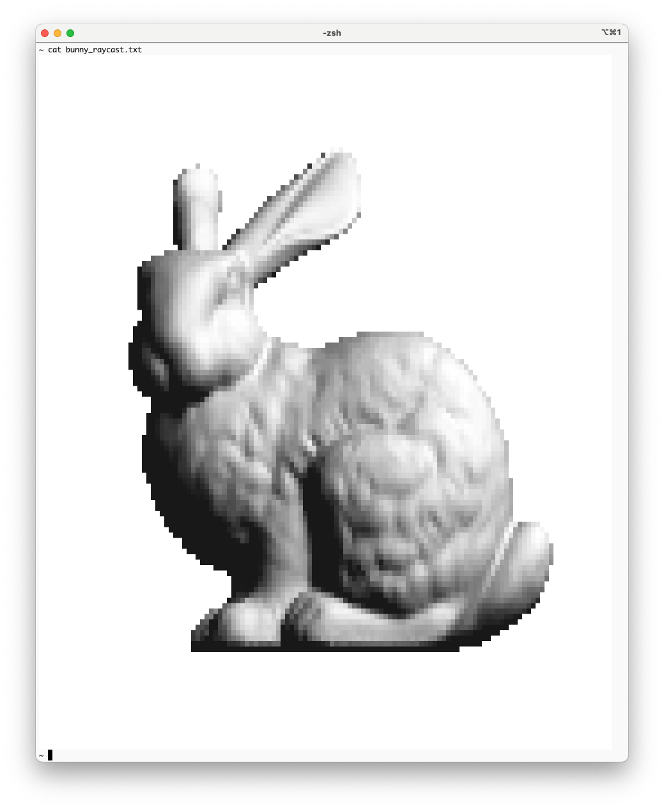

# 3次元モデルのレンダリング

レイキャスティングを用いてレンダリングし，ANSIエスケープを用いて色を塗り，ターミナルに描画する．



### 概略
前処理を行ったあと，`draw_mesh()` を呼び，レイキャスティングによるレンダリングを行う．`draw_mesh()` では，半角１文字ごとに文字"▀"に対して文字色と背景色を関数 `compute_RGB()` によって計算し出力する．平行投影法を用いるため，レイの方向ベクトルは常に一定の値とし，ピクセルごとに視点を設定する．`compute_RGB()`では，レイと面が交差する場合，その交点の法線ベクトル，環境光，拡散反射光の値，光源に向かうベクトルを用いて，色を計算する．交差判定は `ray_mesh_intersection()` によって行う．これは，ひとつのレイに対して全ての三角形との交差判定を行い，最も視点に近い交点の座標とその面の添え字を計算する関数である．最近点はレイのパラメータtが最小である点とした．


### サンプル出力の情報
- 入力：`bunny.obj`
- 出力：`bunny_raycast.txt`
- 作成コマンド
```
./実行ファイル bunny.obj 64 64 > bunny_raycast.txt
```
- メッシュ : 孤立頂点を削除した Stanford Bunny（頂点数34834, 面数69451）
- 実行時間 : 12.7626 秒

**iTerm**上で`cat bunny_raycast.txt`を行うことで実行結果を確認することができる．
